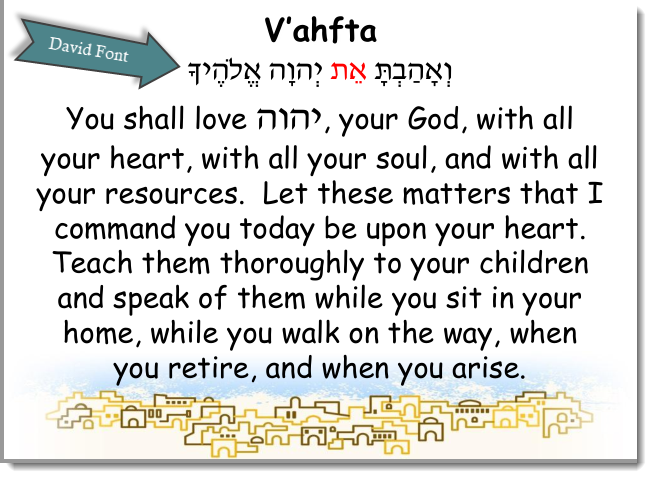
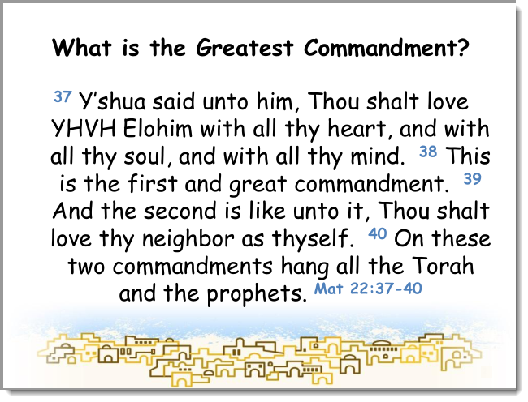

# Living Messiah Ministries PowerPoint Slide Deck

# Changes
Proposed changes

## Part 4: Oseh Shalom
- Oseh Shalom
- Sh'ma (Hebrew and English)
- V'Haftah (spread over two slides)
  - [What is the Greatest Commandment] 

## 1. Update Slide - V’ahfta (not V'Haftah)
> I think we have been transliterating / saying this wrong.  It’s not *V’Haftah* it’s *V’ahfta*. The *heh* towards the begging of the word is not after the *vav* but after the *aleph*.  Also there is not a *heh* at the end of the word
I added the Hebrew in the second line for many reasons. It’s showing why this is called what it’s scalled i.e. it’s the first for the verse Deu 6:5; it’s got a standalone aleph tav right before YHVH; the last Hebrew gives the proper pronunciation of “your God” i.e. Elohecha

## 2. New Slide after V’ahfta Mat 22:37-40
I think it's a fair criticism that in our liturgy we do not bring out the Messiah enough. Adding this slide might be a way to rectify this.  If accepted, how would this be implemented is a valid question because the text was already in the previous two slides (*Sh'ma* and *V'ahfta*).  How would the cadence work?  So as to not take up more time then necessary, maybe Mark could just pause briefly and point this slide out with out reading it.

> (see The-Great-Commission-is-to-Teach-Torah, https://www.myhebrewbible.com/Article/253)

## 3. Change the Hebrew font to the David font

## 4. Weekly Automation 
It would be nice if there was a process where each week where the slides could be *compiled* by incorporating the static parts with the dynamic parts.  
- Process: Copy Part 2 up to a shared drive which would trigger an event to merge it with the other decks and save that deck to a folder with the the date as part of the name (e.g. 2019-12-31).  E.g. [see](https://superuser.com/questions/1081012/how-to-merge-multiple-powerpoint-files-into-one-file)

## 5. GitHub - Open Source
 - Place this decks as an open source project on GitHub along with the website